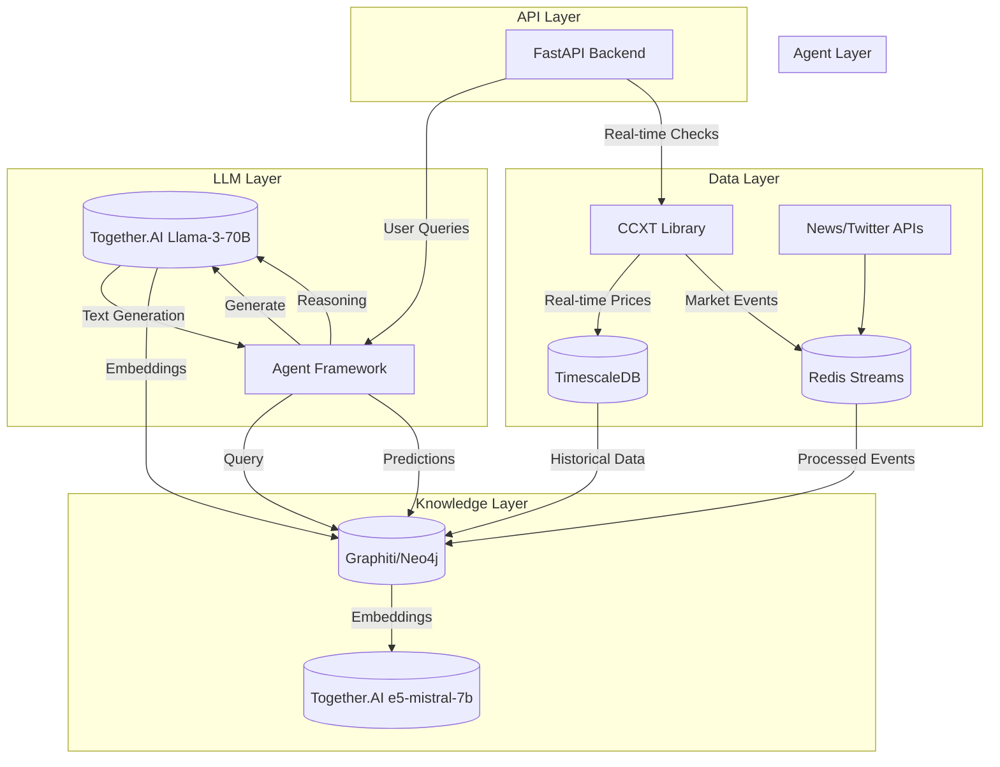

# Agent-Based Graph RAG for Cryptocurrency Market Analysis

A sophisticated system combining real-time market data, knowledge graphs, and LLM-powered agents for predictive cryptocurrency market analysis.

> **Current Development Focus**: LLM Integration & Testing  
> **Version**: 0.5.0 (Beta)  
> **Last Updated**: November 2023

## 🚀 Features

- **Real-time Data**
  - Stream live market data from 100+ exchanges via CCXT
  - Historical data backfilling
  - Customizable data collection intervals

- **Advanced Analytics**
  - Technical indicators (RSI, MACD, Bollinger Bands, etc.)
  - Pattern recognition
  - Volume analysis
  - Market sentiment analysis

- **Knowledge Graph**
  - Temporal relationship modeling
  - Market event correlation
  - Asset relationship mapping

- **Multi-Agent System**
  - Specialized agents for different analysis types
  - Collaborative decision making
  - Adaptive learning capabilities

- **LLM Integration**
  - Together.AI API integration for text generation
  - Support for multiple LLM models
  - Asynchronous API handling with retries
  - Comprehensive test coverage

- **API First**
  - RESTful endpoints for all features
  - WebSocket support for real-time updates
  - Comprehensive API documentation
  - Rate limiting and error handling

## 🏗️ Architecture



## 📦 Prerequisites

- Python 3.10+
- Docker & Docker Compose
- Railway CLI (for deployment)
- Together.AI API key

## 🛠️ Setup

### Prerequisites

- Docker 20.10+
- Docker Compose 2.0+
- Python 3.10+ (for local development)
- Make (optional, for convenience commands)

### Quick Start

1. Clone the repository and navigate to the project directory:
   ```bash
   git clone https://github.com/yllvar/crypto.-graphrag.git
   cd crypto.-graphrag
   ```

2. Copy the example environment file and update with your configuration:
   ```bash
   cp .env.example .env
   # Edit .env with your API keys and settings
   ```

3. Start the services using Docker Compose:
   ```bash
   docker compose up -d --build
   ```

4. Access the services:
   - API Docs: http://localhost:8000/docs
   - Adminer (Database GUI): http://localhost:8080
   - Neo4j Browser: http://localhost:7474

5. Initialize the database (run in a new terminal):
   ```bash
   # Apply database migrations
   docker compose exec app alembic upgrade head
   
   # Initialize with sample data (optional)
   docker compose exec app python -m scripts.init_db
   ```

### Development Setup

For local development with hot-reloading:

1. Install Python dependencies:
   ```bash
   python -m venv venv
   source venv/bin/activate  # On Windows: venv\Scripts\activate
   pip install -r requirements-dev.txt
   ```

2. Start the development server:
   ```bash
   uvicorn src.api.main:app --reload --host 0.0.0.0 --port 8000
   ```

3. Run tests:
   ```bash
   pytest tests/ -v
   ```

### Environment Variables

Create a `.env` file in the project root with the following variables:

```env
# Database
POSTGRES_USER=postgres
POSTGRES_PASSWORD=postgres
POSTGRES_DB=crypto
POSTGRES_HOST=timescaledb
POSTGRES_PORT=5432

# Redis
REDIS_HOST=redis
REDIS_PORT=6379

# Neo4j
NEO4J_URI=bolt://neo4j:7687
NEO4J_USER=neo4j
NEO4J_PASSWORD=your_secure_password

# Exchange API (e.g., Binance)
BINANCE_API_KEY=your_api_key
BINANCE_API_SECRET=your_api_secret

# Optional: Set to 'development' or 'production'
ENVIRONMENT=development
```

### Using Makefile (Optional)

The project includes a Makefile with common commands:

```bash
make up        # Start all services
make down      # Stop all services
make logs      # View logs
make test      # Run tests
make lint      # Run linters
make format    # Format code
```
   ```bash
   git clone https://github.com/your-org/graphrag-crypto.git
   cd graphrag-crypto
   ```

2. Install dependencies:
   ```bash
   pip install -r requirements.txt
   ```

3. Set up environment variables:
   ```bash
   cp .env.example .env
   # Edit .env with your credentials
   ```

4. Start services:
   ```bash
   docker-compose up -d
   ```

## 📚 Documentation

- [System Architecture](/docs/architecture.md)
- [API Reference](/docs/api/README.md)
- [Agent Framework](/docs/agents/README.md)
- [Deployment Guide](/docs/deployment/README.md)
- [Development Guide](/docs/development/README.md)

## 🤝 Contributing

Contributions are welcome! Please read our [Contributing Guide](CONTRIBUTING.md) for details.

## 📄 License

This project is licensed under the MIT License - see the [LICENSE](LICENSE) file for details.
