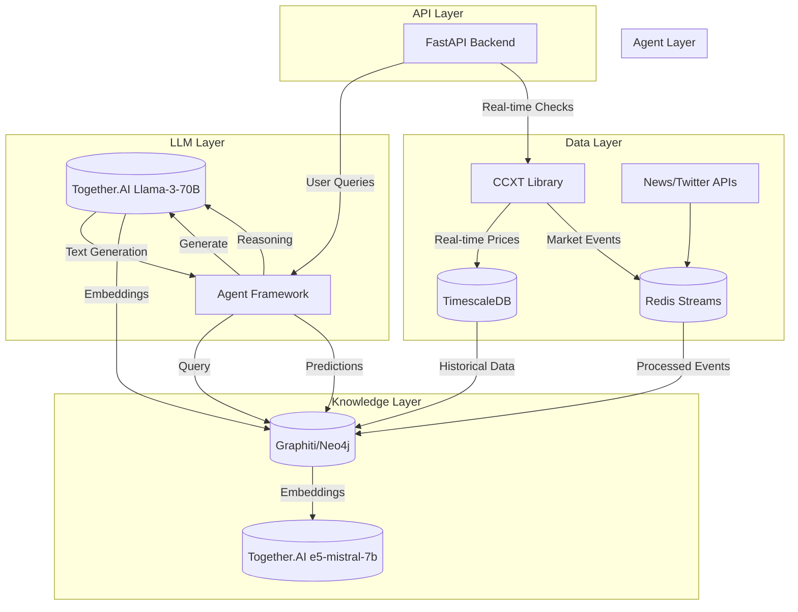

# Agent-Based Graph RAG for Cryptocurrency Market Analysis


https://github.com/user-attachments/assets/a85c983c-fb20-4182-9ed3-328fe739c0bf


A RAG system combining real-time market data, knowledge graphs, and LLM-powered agents for embedded predictive cryptocurrency market analysis.

## 🚀 Features

- **Real-time Data**
  - Stream live market data from 100+ exchanges via CCXT
  - Historical data backfilling
  - Customizable data collection intervals

- **Advanced Analytics**
  - Technical indicators (RSI, MACD, Bollinger Bands, etc.)
  - Pattern recognition
  - Volume analysis
  - Market sentiment analysis

- **Knowledge Graph**
  - Temporal relationship modeling
  - Market event correlation
  - Asset relationship mapping

- **Multi-Agent System**
  - Specialized agents for different analysis types
  - Collaborative decision making
  - Adaptive learning capabilities

- **LLM Integration**
  - Together.AI API integration for text generation
  - Support for multiple LLM models
  - Asynchronous API handling with retries
  - Comprehensive test coverage

- **API First**
  - RESTful endpoints for all features
  - WebSocket support for real-time updates
  - Comprehensive API documentation
  - Rate limiting and error handling

## 🏗️ Architecture



## 📦 Prerequisites

- Python 3.10+
- Docker & Docker Compose
- Railway CLI (for deployment)
- Together.AI API key

## 🛠️ Setup

### Prerequisites

- Docker 20.10+
- Docker Compose 2.0+
- Python 3.10+ (for local development)
- Make (optional, for convenience commands)

### Using Makefile 

The project includes a Makefile with common commands:

```bash
make up        # Start all services
make down      # Stop all services
make logs      # View logs
make test      # Run tests
make lint      # Run linters
make format    # Format code
```
   ```bash
   git clone https://github.com/your-org/graphrag-crypto.git
   cd graphrag-crypto
   ```

2. Install dependencies:
   ```bash
   pip install -r requirements.txt
   ```

3. Set up environment variables:
   ```bash
   cp .env.example .env
   # Edit .env with your credentials
   ```

4. Start services:
   ```bash
   docker-compose up -d
   ```

## 📄 License

This project is licensed under the MIT License - see the [LICENSE](LICENSE) file for details.
