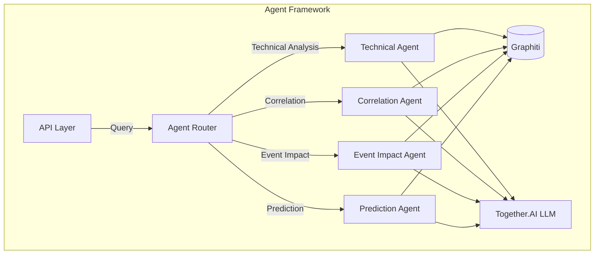
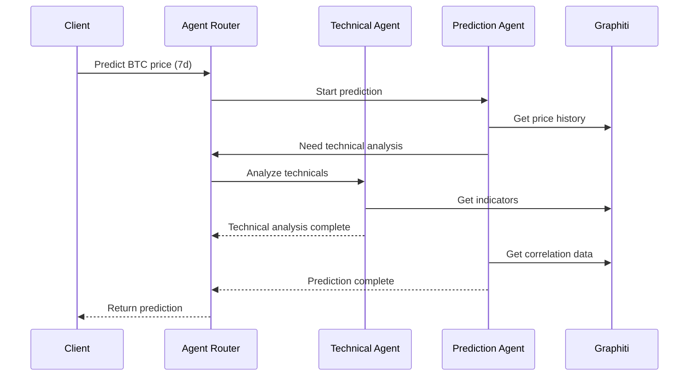

# Agent Framework

The Agent Framework is the core intelligence layer of the GraphRAG system, responsible for analyzing market data, generating insights, and making predictions using a combination of traditional financial analysis and modern AI techniques.

## Architecture



## Agent Types

### 1. Technical Analysis Agent

**Purpose**: Analyze price and volume data to identify patterns and trends.

**Key Features**:
- Calculates technical indicators (RSI, MACD, Bollinger Bands, etc.)
- Identifies chart patterns (head and shoulders, triangles, etc.)
- Detects support and resistance levels
- Identifies trend direction and strength

**Example Usage**:
```python
from agents.technical import TechnicalAnalysisAgent

ta_agent = TechnicalAnalysisAgent()
analysis = ta_agent.analyze(
    symbol="BTC/USDT",
    interval="1d",
    indicators=["rsi", "macd", "bollinger_bands"]
)
```

### 2. Correlation Agent

**Purpose**: Analyze relationships between different assets and markets.

**Key Features**:
- Calculates correlation coefficients
- Identifies lead-lag relationships
- Detects market regime changes
- Analyzes cross-asset relationships

**Example Usage**:
```python
from agents.correlation import CorrelationAgent

corr_agent = CorrelationAgent()
correlation = corr_agent.analyze(
    symbols=["BTC/USDT", "ETH/USDT", "SP500", "DXY"],
    window="30d",
    method="pearson"
)
```

### 3. Event Impact Agent

**Purpose**: Analyze and quantify the impact of market events.

**Key Features**:
- News sentiment analysis
- Social media trend detection
- Event classification and scoring
- Impact assessment

**Example Usage**:
```python
from agents.event import EventImpactAgent

event_agent = EventImpactAgent()
impact = event_agent.analyze(
    event_text="Bitcoin ETF approved by SEC",
    source="coindesk.com",
    timestamp="2023-10-15T14:30:00Z"
)
```

### 4. Prediction Agent

**Purpose**: Generate price predictions and trading signals.

**Key Features**:
- Price forecasting
- Confidence interval calculation
- Risk assessment
- Signal generation

**Example Usage**:
```python
from agents.prediction import PredictionAgent

pred_agent = PredictionAgent()
prediction = pred_agent.predict(
    symbol="BTC/USDT",
    horizon_days=7,
    confidence_level=0.95
)
```

## Agent Communication

Agents communicate through the knowledge graph and can trigger each other's analysis when needed.



## Implementation Details

### Base Agent Class

All agents inherit from the `BaseAgent` class which provides common functionality:

```python
from abc import ABC, abstractmethod

class BaseAgent(ABC):
    def __init__(self, graph_client, llm_client):
        self.graph = graph_client
        self.llm = llm_client
        self.cache = {}
    
    @abstractmethod
    async def analyze(self, **kwargs):
        """Main analysis method to be implemented by subclasses"""
        pass
    
    async def _get_from_graph(self, query, params=None):
        """Helper method to query the knowledge graph"""
        return await self.graph.execute_query(query, params)
    
    async def _generate_with_llm(self, prompt, **kwargs):
        """Helper method to generate text with the LLM"""
        return await self.llm.generate(prompt, **kwargs)
```

### Agent Configuration

Agents are configured using YAML files for easy customization:

```yaml
# config/agents/technical_agent.yaml
name: technical_agent
version: 1.0.0
indicators:
  rsi:
    window: 14
    overbought: 70
    oversold: 30
  macd:
    fast_period: 12
    slow_period: 26
    signal_period: 9
  bollinger_bands:
    window: 20
    num_std: 2
cache_ttl: 3600  # 1 hour
```

### Error Handling

Agents implement robust error handling and retry logic:

```python
class AgentError(Exception):
    """Base exception for agent-related errors"""
    pass

class RetryableError(AgentError):
    """Error that can be retried"""
    pass

class ValidationError(AgentError):
    """Error in input validation"""
    pass
```

## Performance Considerations

### Caching

Agents implement multi-level caching:
1. In-memory cache for frequently accessed data
2. Redis cache for distributed caching
3. Graph database cache for query results

### Parallel Processing

Heavy computations are parallelized using asyncio:

```python
import asyncio

async def analyze_multiple_symbols(agent, symbols):
    tasks = [agent.analyze(symbol) for symbol in symbols]
    return await asyncio.gather(*tasks, return_exceptions=True)
```

### Batch Processing

For bulk operations, agents support batch processing:

```python
class TechnicalAnalysisAgent(BaseAgent):
    async def analyze_batch(self, symbols, indicators=None):
        """Analyze multiple symbols in a single batch"""
        if indicators is None:
            indicators = self.default_indicators
            
        results = {}
        for symbol in symbols:
            try:
                results[symbol] = await self.analyze(symbol, indicators)
            except AgentError as e:
                logger.error(f"Error analyzing {symbol}: {e}")
                results[symbol] = {"error": str(e)}
                
        return results
```

## Testing

Agents include comprehensive test suites:

```python
import pytest
from agents.technical import TechnicalAnalysisAgent

@pytest.mark.asyncio
async def test_technical_analysis():
    agent = TechnicalAnalysisAgent()
    result = await agent.analyze("BTC/USDT", ["rsi", "macd"])
    
    assert "rsi" in result
    assert "macd" in result
    assert 0 <= result["rsi"]["value"] <= 100
```

## Monitoring

Agent performance is monitored using Prometheus metrics:

```python
from prometheus_client import Counter, Histogram

class AgentMetrics:
    REQUESTS = Counter(
        'agent_requests_total',
        'Total number of agent requests',
        ['agent_type', 'status']
    )
    
    LATENCY = Histogram(
        'agent_request_duration_seconds',
        'Agent request duration in seconds',
        ['agent_type']
    )

class BaseAgent:
    def __init__(self, agent_type):
        self.agent_type = agent_type
        self.metrics = AgentMetrics()
    
    async def analyze(self, **kwargs):
        start_time = time.time()
        try:
            result = await self._analyze_impl(**kwargs)
            self.metrics.REQUESTS.labels(
                agent_type=self.agent_type,
                status='success'
            ).inc()
            return result
        except Exception as e:
            self.metrics.REQUESTS.labels(
                agent_type=self.agent_type,
                status='error'
            ).inc()
            raise
        finally:
            duration = time.time() - start_time
            self.metrics.LATENCY.labels(
                agent_type=self.agent_type
            ).observe(duration)
```

## Deployment

Agents are deployed as microservices in Kubernetes:

```yaml
# k8s/agents/technical-agent.yaml
apiVersion: apps/v1
kind: Deployment
metadata:
  name: technical-agent
spec:
  replicas: 3
  selector:
    matchLabels:
      app: technical-agent
  template:
    metadata:
      labels:
        app: technical-agent
    spec:
      containers:
      - name: technical-agent
        image: graphrag/agent-technical:1.0.0
        resources:
          limits:
            cpu: "2"
            memory: "4Gi"
          requests:
            cpu: "1"
            memory: "2Gi"
        env:
        - name: GRAPHITI_URI
          valueFrom:
            secretKeyRef:
              name: graphiti-credentials
              key: uri
        - name: TOGETHER_API_KEY
          valueFrom:
            secretKeyRef:
              name: together-credentials
              key: api-key
```

## Best Practices

1. **Idempotency**: All agent operations are idempotent
2. **Stateless**: Agents maintain no internal state between requests
3. **Retry Logic**: Implement exponential backoff for transient failures
4. **Circuit Breaking**: Fail fast when dependent services are unavailable
5. **Rate Limiting**: Respect API rate limits and implement backpressure
6. **Tracing**: Include request IDs for distributed tracing
7. **Logging**: Structured logging with consistent fields
8. **Metrics**: Export performance and error metrics

## Extending the Framework

To create a new agent:

1. Create a new class that inherits from `BaseAgent`
2. Implement the `analyze` method
3. Add configuration in `config/agents/`
4. Write tests in `tests/agents/`
5. Update the agent router to include your new agent

Example new agent:

```python
from agents.base import BaseAgent

class SentimentAgent(BaseAgent):
    """Analyzes market sentiment from news and social media"""
    
    def __init__(self, graph_client, llm_client):
        super().__init__(graph_client, llm_client)
        self.name = "sentiment_agent"
        self.version = "1.0.0"
    
    async def analyze(self, text, source=None, timestamp=None):
        """Analyze sentiment of the given text"""
        prompt = f"""
        Analyze the sentiment of the following text regarding cryptocurrency markets:
        
        {text}
        
        Return a JSON response with:
        - sentiment: positive, neutral, or negative
        - confidence: 0.0 to 1.0
        - key_phrases: list of important phrases
        - impact_score: -1.0 to 1.0 (negative to positive impact)
        """
        
        result = await self._generate_with_llm(prompt)
        return self._parse_response(result)
    
    def _parse_response(self, response):
        # Parse and validate the LLM response
        try:
            data = json.loads(response)
            return {
                'sentiment': data['sentiment'],
                'confidence': float(data['confidence']),
                'key_phrases': data.get('key_phrases', []),
                'impact_score': float(data.get('impact_score', 0))
            }
        except (json.JSONDecodeError, KeyError, ValueError) as e:
            raise ValidationError(f"Invalid response format: {e}")
```

## Troubleshooting

Common issues and solutions:

1. **High Latency**
   - Check Redis cache hit rate
   - Verify database query performance
   - Monitor LLM response times

2. **Rate Limiting**
   - Implement exponential backoff
   - Cache responses when possible
   - Request higher rate limits if needed

3. **Data Inconsistencies**
   - Verify data sources
   - Check for synchronization issues
   - Implement data validation

## Contributing

See [CONTRIBUTING.md](../../CONTRIBUTING.md) for guidelines on contributing to the agent framework.
